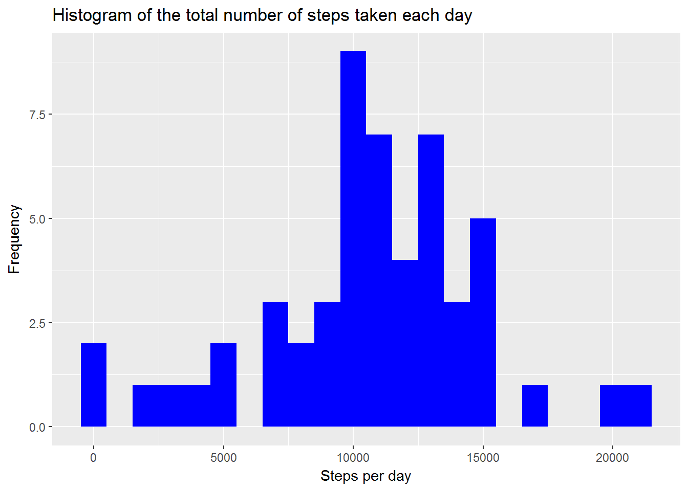
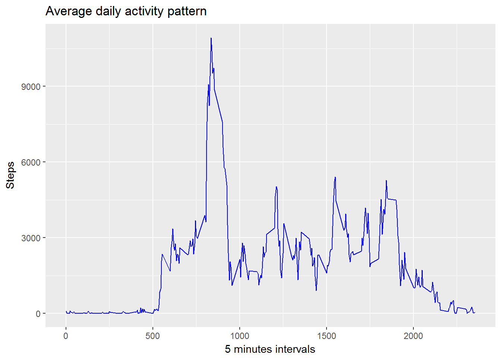
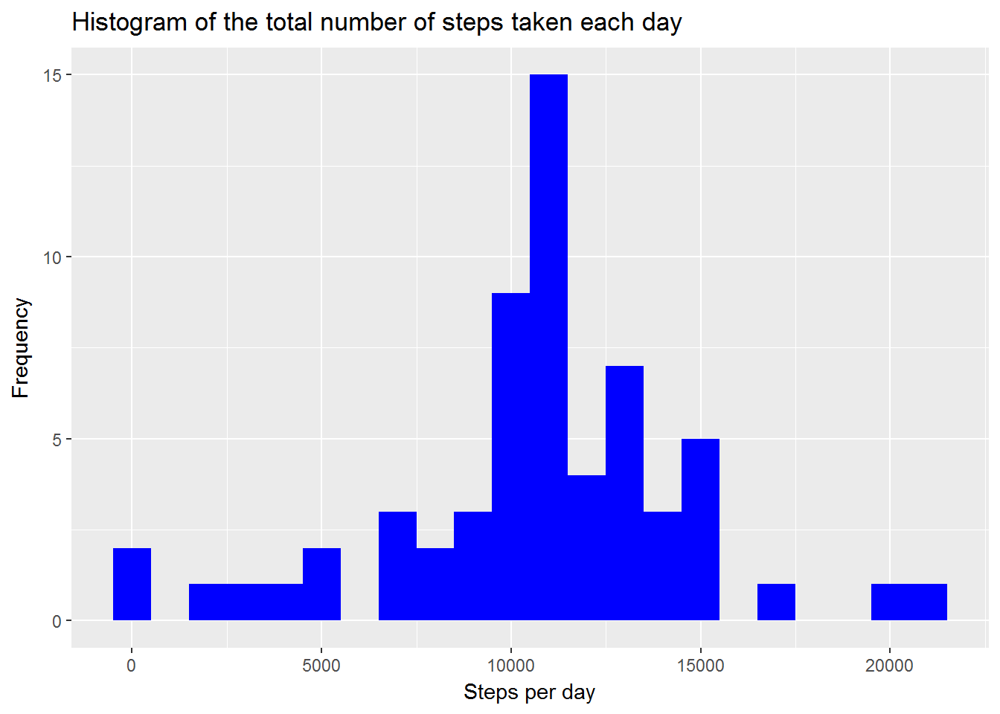
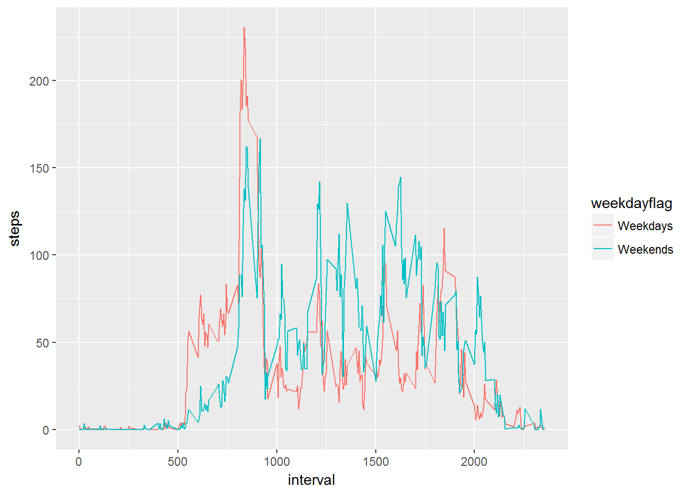

## Introduction

This project provides analysis of activity monitoring devices using [Activity monitoring data](https://d396qusza40orc.cloudfront.net/repdata%2Fdata%2Factivity.zip) dataset.

The variables included in this dataset are:
1. steps: Number of steps taking in a 5-minute interval (missing values are coded as NA)
2. date: The date on which the measurement was taken in YYYY-MM-DD format
3. interval: Identifier for the 5-minute interval in which measurement was taken

Analysis includes following sections

1. Loading and preprocessing the data
2. What is mean total number of steps taken per day?
3. What is the average daily activity pattern?
4. Imputing missing values
5. Are there differences in activity patterns between weekdays and weekends?

###Loading and preprocessing the data
This section provides datails on importing dataset and preprocessing the data.

Unzip data to obtain a csv file.
```r
unzip("activity.zip",exdir = "data")
```
Reading the data into activity data frame and show some summary statistics

Using "readr" package import downloaded activity dataset.
```{r, echo=TRUE}
library(readr)
activity <- read_csv("data/activity.csv")
head(activity)
```
```{r}
## Parsed with column specification:
## cols(
##   steps = col_integer(),
##   date = col_date(format = ""),
##   interval = col_integer()
## )

## # A tibble: 6 x 3
##   steps       date interval
##   <int>     <date>    <int>
## 1    NA 2012-10-01        0
## 2    NA 2012-10-01        5
## 3    NA 2012-10-01       10
## 4    NA 2012-10-01       15
## 5    NA 2012-10-01       20
## 6    NA 2012-10-01       25
```

Validate all the datatype
```{r, echo=TRUE}
str(activity)
```

```{r}
## Classes 'tbl_df', 'tbl' and 'data.frame':    17568 obs. of  3 variables:
##  $ steps   : int  NA NA NA NA NA NA NA NA NA NA ...
##  $ date    : Date, format: "2012-10-01" "2012-10-01" ...
##  $ interval: int  0 5 10 15 20 25 30 35 40 45 ...
##  - attr(*, "spec")=List of 2
##   ..$ cols   :List of 3
##   .. ..$ steps   : list()
##   .. .. ..- attr(*, "class")= chr  "collector_integer" "collector"
##   .. ..$ date    :List of 1
##   .. .. ..$ format: chr ""
##   .. .. ..- attr(*, "class")= chr  "collector_date" "collector"
##   .. ..$ interval: list()
##   .. .. ..- attr(*, "class")= chr  "collector_integer" "collector"
##   ..$ default: list()
##   .. ..- attr(*, "class")= chr  "collector_guess" "collector"
##   ..- attr(*, "class")= chr "col_spec"
```

###What is mean total number of steps taken per day?
For this section, we are ignoring the missing values in the dataset
1. Calculating the total number of steps taken per day
```{r, echo=TRUE}
library(dplyr)
stepstakenperday <- activity %>%
  filter(!is.na(steps)) %>%
  group_by(date) %>%
  summarize(steps = sum(steps)) %>%
  print
```
```{r}
## # A tibble: 53 x 2
##          date steps
##        <date> <int>
##  1 2012-10-02   126
##  2 2012-10-03 11352
##  3 2012-10-04 12116
##  4 2012-10-05 13294
##  5 2012-10-06 15420
##  6 2012-10-07 11015
##  7 2012-10-09 12811
##  8 2012-10-10  9900
##  9 2012-10-11 10304
## 10 2012-10-12 17382
## # ... with 43 more rows
```

2. Histogram of the total number of steps taken each day
```{r, echo=TRUE}
library(ggplot2)
ggplot(stepstakenperday, aes(x = steps)) +
  geom_histogram(fill = "blue", binwidth = 1000) +
  labs(title = "Histogram of the total number of steps taken each day", x = "Steps per day", y = "Frequency")
```

 

3. Calculating the mean and median of the total number of steps taken per day
```{r, echo=TRUE}
mean_steps_per_day <- mean(stepstakenperday$steps, na.rm = TRUE)
median_steps_per_day <- median(stepstakenperday$steps, na.rm = TRUE)
paste("Mean steps per day:", mean_steps_per_day)
paste("median steps per day:" , median_steps_per_day)
```
```{r, echo=TRUE}
## [1] "Mean steps per day: 10766.1886792453"
## [1] "median steps per day: 10765"
```

###What is the average daily activity pattern?

Time series plot (i.e. type = "l") of the 5-minute interval (x-axis) and the average number of steps taken, averaged across all days (y-axis)
```{r, echo= TRUE}
averagedailyactivitypattern <- activity %>%
  filter(!is.na(steps)) %>%
  group_by(interval) %>%
  summarize(steps = sum(steps)) %>%
  print

```{r}
## # A tibble: 288 x 2
##    interval steps
##       <int> <int>
##  1        0    91
##  2        5    18
##  3       10     7
##  4       15     8
##  5       20     4
##  6       25   111
##  7       30    28
##  8       35    46
##  9       40     0
## 10       45    78
## # ... with 278 more rows
```

ggplot(averagedailyactivitypattern, aes(x=interval, y=steps)) +
  geom_line(color = "blue")+
  labs(title = "Average daily activity pattern", x = "5 minutes intervals", y = "Steps")
```

 

Display 5-minute interval, on average across all the days in the dataset, containing the maximum number of steps.
```{r, echo= TRUE}
IntervalWithMaxSteps <- filter(averagedailyactivitypattern,averagedailyactivitypattern$steps == max(averagedailyactivitypattern$steps) ) 
paste("Interval with Maximum number of steps:", IntervalWithMaxSteps$interval)
```

```{r}
## [1] "Interval with Maximum number of steps: 835"
```

###Imputing missing values
There are 2304 missing values in dataset.
Creating new dataset and using "mean for that 5-minute interval" to update the missing values.

Create dataset without nulls and get mean steps for each interval
```{r, echo= TRUE}
activity_data_without_na <- filter(activity,is.na(activity$steps) == FALSE)
average_steps_per_interval <- activity_data_without_na %>%
  group_by(interval) %>%
  summarize(steps = mean(steps)) 
```
Merge original dataset "activity" with dataset "interval with mean steps"
```{r, echo= TRUE}
mergedactivty <- merge(activity,average_steps_per_interval, by ="interval")
```
Repleace NA with mean steps
```{r, echo= TRUE}
mergedactivty <- mergedactivty %>%
  mutate(steps = ifelse(is.na(steps.x),steps.y,steps.x))  %>%
  select(steps,date,interval)
head(mergedactivty)
```

```{r}
##      steps       date interval
## 1 1.716981 2012-10-01        0
## 2 0.000000 2012-11-23        0
## 3 0.000000 2012-10-28        0
## 4 0.000000 2012-11-06        0
## 5 0.000000 2012-11-24        0
## 6 0.000000 2012-11-15        0
```


Mergedactivity dataset contains zero missing values.

histogram of the total number of steps taken each day.
```{r, echo= TRUE}

stepstakenperday2 <- mergedactivty %>%
  filter(!is.na(steps)) %>%
  group_by(date) %>%
  summarize(steps = sum(steps)) %>%
  print

library(ggplot2)
ggplot(stepstakenperday2, aes(x = steps)) +
  geom_histogram(fill = "blue", binwidth = 1000) +
  labs(title = "Histogram of the total number of steps taken each day", x = "Steps per day", y = "Frequency")
```

```{r}
## # A tibble: 61 x 2
##          date    steps
##        <date>    <dbl>
##  1 2012-10-01 10766.19
##  2 2012-10-02   126.00
##  3 2012-10-03 11352.00
##  4 2012-10-04 12116.00
##  5 2012-10-05 13294.00
##  6 2012-10-06 15420.00
##  7 2012-10-07 11015.00
##  8 2012-10-08 10766.19
##  9 2012-10-09 12811.00
## 10 2012-10-10  9900.00
## # ... with 51 more rows
```


Calculate and report the mean and median total number of steps taken per day.
```{r, echo= TRUE}
mean_steps_per_day2 <- mean(stepstakenperday2$steps, na.rm = TRUE)
median_steps_per_day2 <- median(stepstakenperday2$steps, na.rm = TRUE)
paste("Original Mean steps per day:", mean_steps_per_day)
paste("Original median steps per day:" , median_steps_per_day)
paste("Mean steps per day:", mean_steps_per_day2)
paste("median steps per day:" , median_steps_per_day2)
```

```{r}
## [1] "Original Mean steps per day: 10766.1886792453"
## [1] "Original median steps per day: 10765"
## [1] "Mean steps per day: 10766.1886792453"
## [1] "median steps per day: 10766.1886792453"
```

###Are there differences in activity patterns between weekdays and weekends?

To check the difference, first, lets add column to the dataset with week day flag
```{r, echo= TRUE}
library(lubridate)
mergedactivty <- mergedactivty %>%
  mutate(weekdayflag = ifelse(wday(date) %in% c(1,7),'Weekends','Weekdays'))  
```

Plot the daily activity pattern with week day flag
```{r, echo= TRUE}
averagedailyactivitypattern <- mergedactivty %>%
  filter(!is.na(steps)) %>%
  group_by(interval,weekdayflag) %>%
  summarize(steps = mean(steps)) %>%
  print
```

```{r}
## # A tibble: 576 x 3
## # Groups:   interval [?]
##    interval weekdayflag       steps
##       <int>       <chr>       <dbl>
##  1        0    Weekdays 2.251153040
##  2        0    Weekends 0.214622642
##  3        5    Weekdays 0.445283019
##  4        5    Weekends 0.042452830
##  5       10    Weekdays 0.173165618
##  6       10    Weekends 0.016509434
##  7       15    Weekdays 0.197903564
##  8       15    Weekends 0.018867925
##  9       20    Weekdays 0.098951782
## 10       20    Weekends 0.009433962
## # ... with 566 more rows
```

```{r, echo= TRUE}
ggplot(averagedailyactivitypattern, aes(x=interval, y=steps, color = weekdayflag)) +
  geom_line()
```

